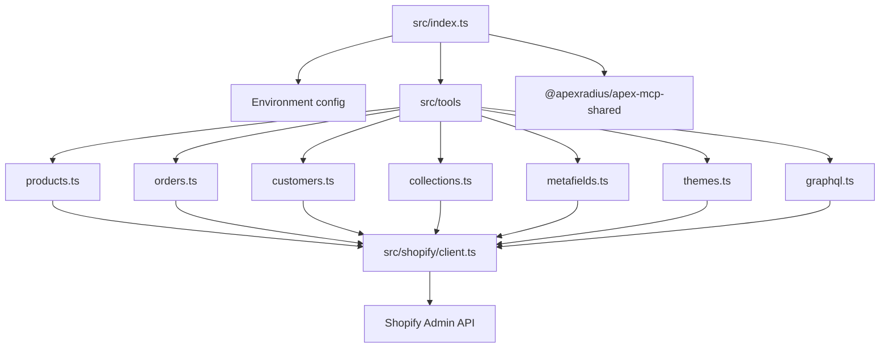
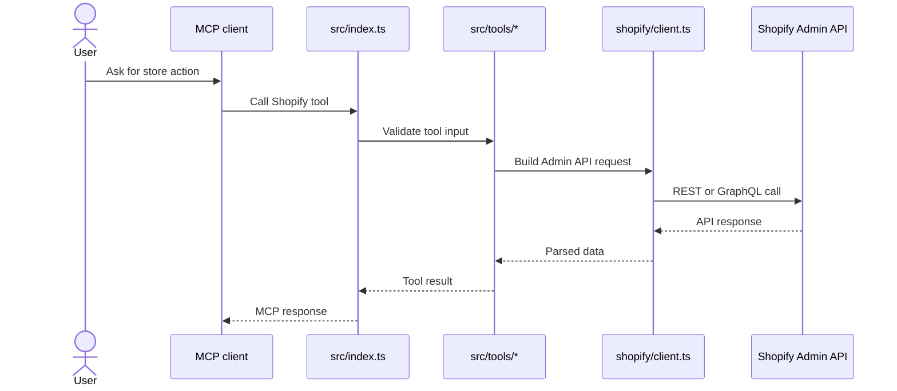

# Architecture

`shopify-admin-mcp` is a TypeScript MCP server that maps tool calls onto Shopify Admin REST and
GraphQL operations.

## Components

## Request Sequence

## Data Boundaries

| Data | Source | Storage |
|---|---|---|
| Store domain | `SHOPIFY_SHOP_DOMAIN` | Environment only. |
| Admin token | `SHOPIFY_ACCESS_TOKEN` | Environment only. |
| API version | `SHOPIFY_API_VERSION` | Environment, defaulted by code. |
| Store data | Shopify Admin API | Returned through MCP; not persisted here. |

## Extension Points

| Change | File |
|---|---|
| Add a tool group | `src/tools/<group>.ts` |
| Change API transport | `src/shopify/client.ts` |
| Register new tools | `src/index.ts` |
| Change package build/lint | `package.json`, `biome.json`, `tsconfig.json` |
